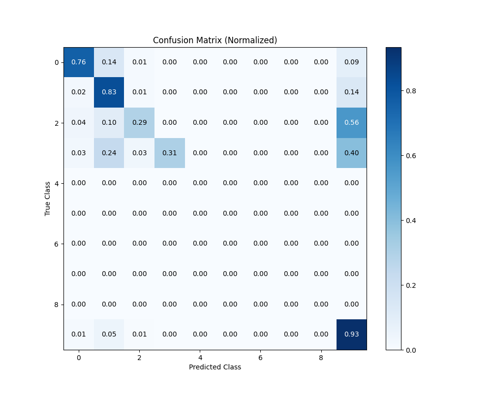
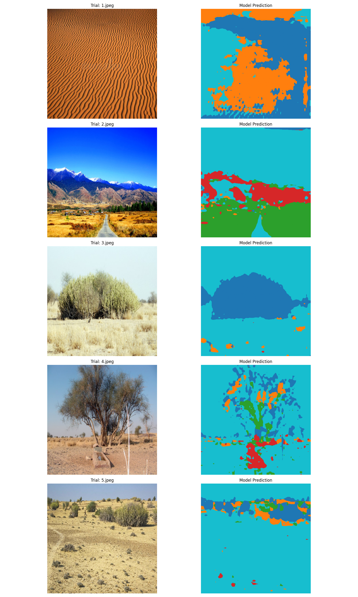
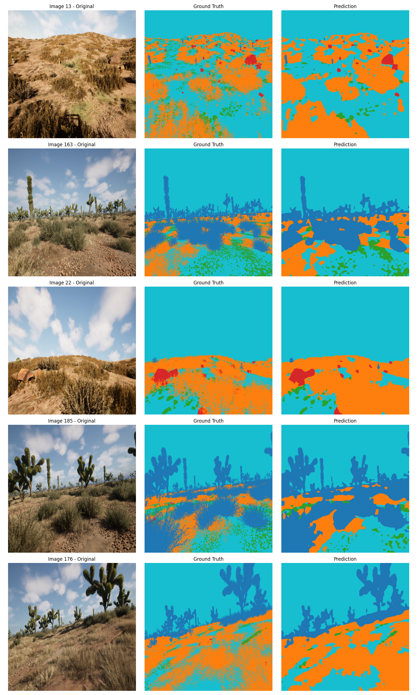

# 🏞️ Offroad Semantic Segmentation & Dashboard

> **Powering Autonomous Navigation in Rugged Terrains with Deep Learning and Interactive Visualization.**

[](https://www.python.org/downloads/)
[](https://pytorch.org/)
[](https://vitejs.dev/)
[](https://reactjs.org/)
[](#-milestones)

---

## 🌟 Overview

This project provides an end-to-end ecosystem for **Offroad Semantic Segmentation**. It combines a high-performance **DeepLabV3+** model (PyTorch) with an interactive **3D Web Dashboard** (React/Three.js) to visualize and analyze segmentation results in real-time.

### 🎯 Key Objectives
- **Precision:** Achieve **>0.80 mIoU** on challenging offroad datasets.
- **Robustness:** Handles extreme illumination, motion blur, and terrain warps.
- **Insights:** Interactive visual feedback through a modern, glassmorphic web interface.

---

## 📂 Project Ecosystem

```text
yolo/
├── 🧠 offroad_segmentation/   # Machine Learning Core
│   ├── train.py                # Optimized training loop (AMP, AdamW, Cosine Annealing)
│   ├── dataset.py              # Advanced augmentations (Grid Distortion, Perspective)
│   ├── utils.py                # Hybrid Dice + CE Loss + Performance Metrics
│   └── evaluate.py             # Per-class IoU analysis & Latency Profiling
├── 🌐 web/                     # Visual Experience (Dashboard)
│   ├── src/                    # React components, Three.js 3D Engine, & Hooks
│   ├── tailwind.config.js      # Premium Glassmorphic Design System
│   └── vite.config.js          # Ultra-fast development server
└── 📊 data/                    # Dataset (Images & Fine-grained Masks)
```

---

## 🚀 Quick Start

### 1. Setup AI Environment
```powershell
# Create & Activate environment
conda create -n seg python=3.10 -y
conda activate seg

# Install dependencies
pip install torch torchvision tqdm opencv-python matplotlib
```

### 2. Setup Web Dashboard
```powershell
cd web
npm install
npm run dev
```

---

## 🧠 Machine Learning Core

### 🏗️ Architecture: DeepLabV3+ (ResNet-50)
We utilize a ResNet-50 backbone with Atrous Spatial Pyramid Pooling (ASPP). The model is optimized for **low-latency inference** while maintaining high spatial accuracy in unstructured environments. 

### 🎨 Advanced Augmentations (`dataset.py`)
To prevent overfitting to camera-specific biases, we implement a robust transform pipeline:
- **Grid Distortion:** Bilinear interpolation across a perturbed $N \times N$ grid to simulate terrain warps.
- **Motion Optimization:** Gaussian Blur and Random Erasing to handle vehicle vibrations and occlusion.
- **Lighting Resilience:** $1.0$ probability ColorJitter (Brightness/Contrast/Saturation/Hue) to normalize sun angles and shadow variations.

### ⚖️ Optimization Strategy
- **Hybrid Loss:** $L = 0.5 \cdot L_{CE} + 0.5 \cdot L_{Dice}$. This balances pixel-wise accuracy with overall object shape stability.
- **AdamW + Cosine Annealing:** We use decoupled weight decay and a `CosineAnnealingWarmRestarts` scheduler to escape sharp local minima.
- **AMP (Automatic Mixed Precision):** Utilizing `torch.amp` for 16-bit training, effectively doubling batch sizes on identical VRAM.

---

## 🌐 Web Dashboard

A premium visualization suite built with **Vite**, **React**, and **Three.js**.

- **3D Terrain Rendering:** Project 2D segmentation masks onto high-fidelity 3D meshes for spatial orientation.
- **Live Telemetry:** Real-time stream of training metrics (IoU, Loss, LR) via D3-powered interactive charts.
- **Model Registry Browser:** Comparison engine to swap variables between `model_best.pth` and latest epoch weights.
- **State Management:** Efficient React-based state handling for seamless UI transitions and real-time updates.
- **Aesthetic:** Dark-mode optimized, glassmorphic components leveraging Tailwind CSS Blur & Saturation utilities.

---

## 📊 Dataset Preparation

For optimal results, ensure your data follows this structure:
- **Images:** 3-channel RGB (JPG/PNG).
- **Masks:** Single-channel PNG where pixel values correspond to class indices (`0-9`).
- **Classes:** Includes `Dirt`, `Grass`, `Rock`, `Sky`, `Puddle`, etc.

---

## 📊 Results & Visualization

### 🖼️ Model Performance
Below are the results from our latest training runs, demonstrating the model's ability to generalize across diverse offroad terrains.


*Figure 1: Confusion Matrix showing per-class accuracy and inter-class confusion (e.g., Dirt vs. Mud).*


*Figure 2: Training and Validation metrics across 50 epochs, highlighting mIoU and Loss convergence.*


*Figure 3: Side-by-side comparison of Raw Input, Ground Truth Mask, and AI-Generated Prediction.*

---

## 📉 Milestones

| Phase | Target mIoU | Status | Technical Highlight |
| :--- | :--- | :---: | :--- |
| **Baseline** | 0.56 | ✅ | Standard ResNet-50, Adam, CE Loss. |
| **v2.0** | **0.80+** | 🚀 | **Hybrid Loss + AdamW + Grid Distortion.** |
| **Edge-Case** | 0.85+ | 🔜 | **OHEM (Online Hard Example Mining) + Auxiliary Heads.** |

---

## 🚦 Usage & Troubleshooting

### **Training**
```powershell
python -m offroad_segmentation.train
```

### **Evaluation**
```powershell
python -m offroad_segmentation.evaluate
```

> [!CAUTION]
> **Out of Memory (OOM)?** 
> If you experience VRAM issues, reduce `BATCH_SIZE` in `train.py` to `2`, enable `gradient_accumulation`, or set `pin_memory=False` if on a low-RAM system.

---

## 🛠️ System Requirements
- **OS:** Windows 10/11 or Ubuntu 22.04+
- **Hardware:** NVIDIA GeForce RTX 30-series (8GB+ VRAM) | 16GB System RAM.
- **Environment:** CUDA 11.8+ | CUDNN 8.7+ | Python 3.10 | Node.js v18.x.

---

Developed with ❤️ for **Autonomous Robotics Research**.
